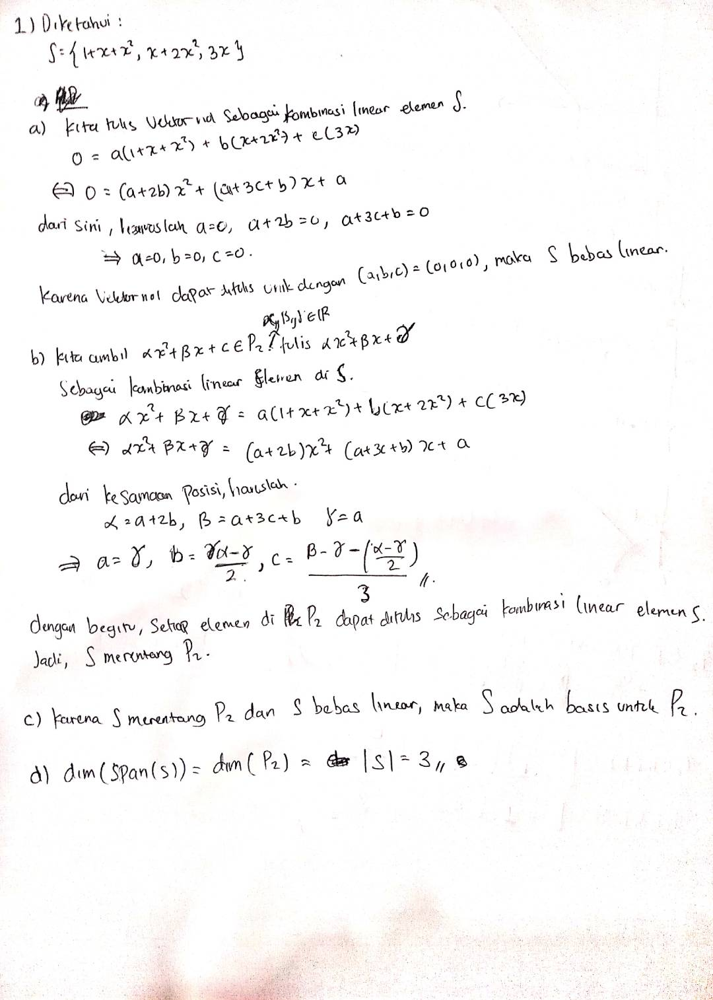

# Responsi-2 (Persiapan Kuis Tertulis)

## Soal 

1. Ruang Vektor $P_2$ memuat semua polinomial yang mempunyai derajat lebih kecil atau sama dengan dua. Misalkan $S=\left\{f_1(x), f_2(x), f_3(x)\right\}$ dengan $f_1(x)=1+x+x^2, f_2(x)=x+2 x^2$, $f_3(x)=3 x$
   - a. [15] Apakah $S$ bebas linier? Tunjukkan dengan menggunakan definisi bebas linier.
   - b. [15] Apakah $S$ merentang $P_2$ ? Tunjukkan dengan menggunakan definisi merentang.

   - c. [10] Apakah $S$ merupakan basis untuk $\operatorname{span}(S)$ ? Jelaskan jawaban anda!
   - d. [10] Carilah dimensi dari $\operatorname{span}(S)$ !
   - 

2. Diketahui sebuah segmen garis KM yang titik-titik ujungnya yaitu $\mathbf{K}(5,0)$ dan $\mathbf{M}(10$, 8). Segmen garis KM tersebut ditransformasikan secara urutan sebagai berikut:
- Dirotasi sebesar $90^0$ searah jarum jam dengan titik putarnya di titik $0(0,0)$, lalu
- Direfleksikan terhadap garis $y=x$.
  
    - a. [10] Carilah matriks transformasi rotasi-nya!
    - b. [10] Carilah matriks transformasi refleksinya!
    -  c. [15] Carilah matriks transformasi komposisi dari kedua transformasi tersebut!
    - d. [15] Carilah titik-titik ujung segmen garis hasil akhir setelah melakukan komposisi dua transformasi di atas berdasarkan matriks komposisinya!

3. Pada ruang untuk $P_1$ diberikan basis-basis $B=\left\{\boldsymbol{p}_1, \boldsymbol{p}_2\right\}$ dan $B^{\prime}=\left\{\boldsymbol{q}_1, \boldsymbol{q}_2\right\}$, dengan $\boldsymbol{p}_1=6+3x, \boldsymbol{p}_2=10+2x, \boldsymbol{q}_1=2$, dan $\boldsymbol{q}_2=3+2 x$
    - a. [12] Dengan menggunakan koordinat vektor, carilah matriks transisi dari $B^{\prime}$ ke $B$.
    - b. [8] Carilah matriks transisi dari $B$ ke $B^{\prime}$.
    - c. [10] Dengan menggunakan matriks transisi, hitunglah $[\boldsymbol{p}]_{B^{\prime}}$ dengan $\boldsymbol{p}=-4+x$ $$.

4. Misalkan $\left\{\mathbf{v}_1, \mathbf{v}_2, \mathbf{v}_3\right\}$ adalah basis ruang vektor$V$. Tunjukkan bahwa $\left\{\mathbf{u}_1, \mathbf{u}_2, \mathbf{u}_3\right\}$ juga basis dari ruang vektor $v$, dimana $\mathbf{u}_1=\mathbf{v}_1, \mathbf{u}_2=\mathbf{v}_1+\mathbf{v}_2$, and $\mathbf{u}_3=\mathbf{v}_1+\mathbf{v}_2+\mathbf{v}_3$.

5. Carilah basis dari ruang null dan ruang kolom dari matriks berikut
$$ A=\left[\begin{array}{rrr}
1 & -1 & 3 \\
5 & -4 & -4 \\
7 & -6 & 2
\end{array}\right]
$$

## Jawaban

